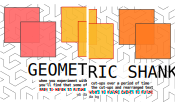
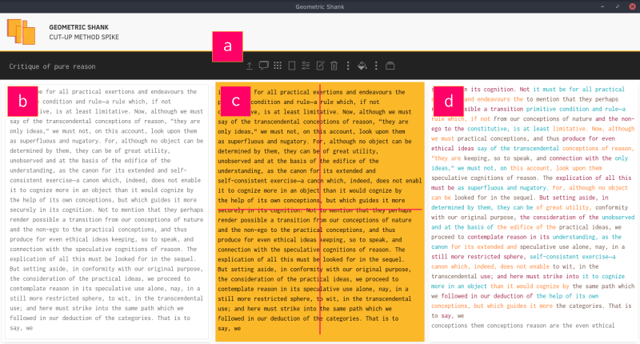

  

## GEOMETRIC SHANK

Geometric explorations of text via cut-up method spiced up by free-path and single word slices. 

Sounds delicious?

### Geometric shank approach to text

This is primarilly a tool for artistic and clairvoyant explorations of one's own text or possibly some notevorthy novel :). It's three panel design provides a linear path to non-linear results. Namely, from left to right, the text box, the cut-up panel and the results panel, follow the destiny of the inbound text, from inception through transformation to fruition.

### Quick start

Paste-in or type any text, but be careful about inspirational flow, since the number of characters is limited to approx. one screen. Also, text can be sourced from a .txt file, or from an internal Public Domain copy of Immanuel Kant's Critique of pure reason. Random excrept can then be  obtained from it (popular victim file). After that, use the available tools to cut, path-cut or pick the words.

<figure>
  
  <figcaption>Geometric shank one and only window. a) toolbar; b) inut text area; c) cut-up panel d) resulst panel.</figcaption>
</figure>

### Project status and downloads

Open-source and forever free, this companion is in its infancy and hopefully will see many more iterations. If there is a contributing impulse to this DADA, William Burroughs and Brion Gysin hommage all forms and shapes of help are welcome.

For now no installers are available. Only source code, which can be cloned and worked on with one speck of yarn install.

### Hopes and dreams

Avoid all slang. Go back to words. Software in-line with creative process, with an emphasis on the burden of future events. Strong non-utilitarian message. Counterculture. 